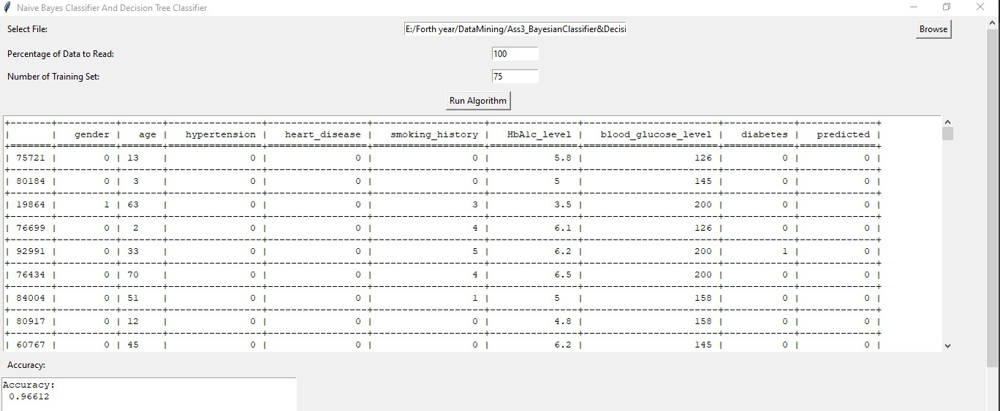
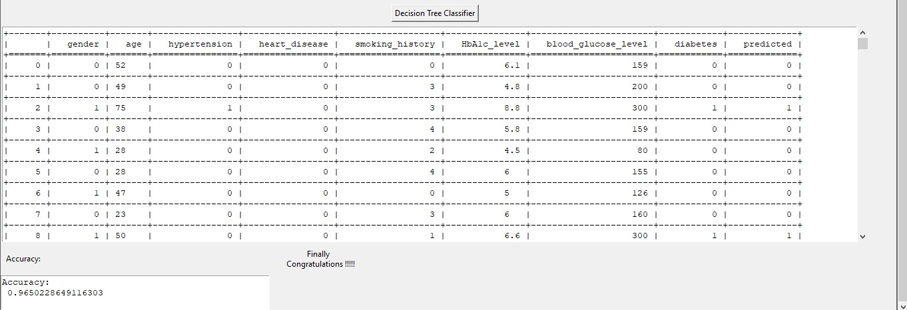

**Project Name: Diabetes Risk Prediction**

---

## Overview:

This project aims to predict the risk of diabetes in patients based on their medical history and demographic information. Two classification algorithms, namely Bayesian classifier and Decision Tree classifier, are employed for this task. The dataset contains features such as age, gender, body mass index (BMI), hypertension, heart disease, smoking history, HbA1c level, and blood glucose level. The class label indicating the presence or absence of diabetes is the last column in the provided dataset.

## Features:

1. **User Interface:**
   - Enables the user to select the percentage of data to be read from the input file.
   - Allows the user to choose the file for analysis.

2. **Data Processing:**
   - Divides the dataset into two subsets: Training Set (75% of data) and Testing Set (25% of data).
   - Size of each dataset is determined by user input.
   - Class Label column is identified as the last column in the chosen file.

3. **Algorithms:**
   - Bayesian Classifier: Utilized to build a predictive model based on the Training Set.
   - Decision Tree Classifier: Another algorithm employed for building a predictive model.

4. **Outputs:**
   - Accuracy of the model for both Bayesian and Decision Tree classifiers.
   - Class labels predicted by the classifiers for the data records provided by the user.

## Instructions:

1. **Input File Selection:**
   - Select the dataset file containing patient records for analysis.

2. **Data Splitting:**
   - Specify the size of the Training Set and Testing Set as per your requirement.

3. **Model Building:**
   - Apply Bayesian and Decision Tree algorithms to build classifier models using the Training Set.

4. **Model Evaluation:**
   - Apply the trained models on the Testing Set to calculate the accuracy of both classifiers.

5. **Result Comparison:**
   - Compare the performance results of the Bayesian and Decision Tree classifiers.

## Usage:

1. **Input File:**
   - Provide a CSV or text file containing patient data.

2. **Percentage Split:**
   - Enter the percentage of data to be used for analysis.

3. **Execute Program:**
   - Run the program using your preferred programming language.

## Sample of data 

| gender | age | hypertension | heart_disease | smoking_history |   bmi  | HbA1c_level | blood_glucose_level | diabetes |
|--------|-----|--------------|---------------|-----------------|--------|-------------|---------------------|----------|
| Female | 80.0|      0       |       1       |      never      | 25.19  |     6.6     |         140         |    0     |
| Female | 54.0|      0       |       0       |      No Info    | 27.32  |     6.6     |          80         |    0     |
| Male   | 28.0|      0       |       0       |      never      | 27.32  |     5.7     |         158         |    0     |
| Female | 36.0|      0       |       0       |      current    | 23.45  |     5.0     |         155         |    0     |
| Male   | 76.0|      1       |       1       |      current    | 20.14  |     4.8     |         155         |    0     |
| Female | 20.0|      0       |       0       |      never      | 27.32  |     6.6     |          85         |    0     |
| Female | 44.0|      0       |       0       |      never      | 19.31  |     6.5     |         200         |    1     |
| Female | 79.0|      0       |       0       |      No Info    | 23.86  |     5.7     |          85         |    0     |
| Male   | 42.0|      0       |       0       |      never      | 33.64  |     4.8     |         145         |    0     |
| Female | 32.0|      0       |       0       |      never      | 27.32  |     5.0     |         100         |    0     |
| Female | 53.0|      0       |       0       |      never      | 27.32  |     6.1     |          85         |    0     |
| Female | 54.0|      0       |       0       |      former     | 54.7   |     6.0     |         100         |    0     |
| Female | 78.0|      0       |       0       |      former     | 36.05  |     5.0     |         130         |    0     |
| Female | 67.0|      0       |       0       |      never      | 25.69  |     5.8     |         200         |    0     |
| Female | 76.0|      0       |       0       |      No Info    | 27.32  |     5.0     |         160         |    0     |
| Male   | 78.0|      0       |       0       |      No Info    | 27.32  |     6.6     |         126         |    0     |
| Male   | 15.0|      0       |       0       |      never      | 30.36  |     6.1     |         200         |    0     |
| Female | 42.0|      0       |       0       |      never      | 24.48  |     5.7     |         158         |    0     |
| Female | 42.0|      0       |       0       |      No Info    | 27.32  |     5.7     |          80         |    0     |

## Example output:

